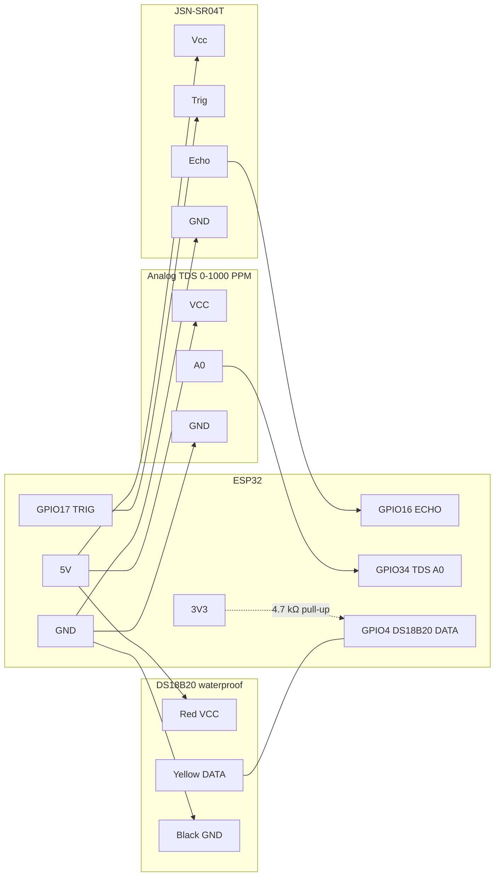
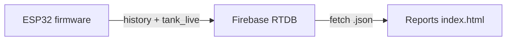

# Water Tank Monitor (ESP32)

This repo has two parts:

1. **Firmware** (`WaterTankSensorSketch.ino`) — ESP32 + ultrasonic, analog TDS, and DS18B20. It measures tank fill level, water temperature, and TDS (PPM, temperature-compensated), then syncs readings to **Firebase Realtime Database** (live snapshot + per-day history). It also exposes a setup portal, NVS-backed settings, optional cloud config, HTTP OTA, and a small local HTTP API.

2. **Reports** (static web app: `index.html`, `app.js`, `styles.css`) — a **browser dashboard** that reads from **Firebase Realtime Database** (REST) and turns `devices/...` data into analytics. **Full reporting documentation**: [docs/REPORTS.md](./docs/REPORTS.md).

**Build / USB flash / OTA / Firebase publish (including what `sha256` is for):** [docs/BUILD_AND_DEPLOY.md](./docs/BUILD_AND_DEPLOY.md).

## Hardware

| Component | Role |
|-----------|------|
| **ESP32** (WiFi stack, `WebServer`, `Preferences`) | Main controller |
| **JSN-SR04T** (or compatible 5 V trigger / echo ultrasonic module) | Distance → water level |
| **Analog TDS module** (0–1000 PPM, waterproof probe) | Water quality (conductivity → PPM) |
| **DS18B20** waterproof probe (1 m) | Water temperature (also used to compensate TDS) |

VCC for the ultrasonic, TDS module, and DS18B20 is **5 V**. ESP32 GPIOs are **not 5 V tolerant** — only analog/data lines that stay ≤ 3.3 V may connect directly.

### Pin assignment

| Device | Signal | ESP32 | Sensor pin |
|--------|--------|-------|------------|
| Ultrasonic | Trigger | **GPIO 17** | Trig |
| Ultrasonic | Echo | **GPIO 16** | Echo * |
| Ultrasonic | Power | **5 V** | Vcc |
| Ultrasonic | Ground | **GND** | Gnd |
| TDS module | Analog | **GPIO 34** (ADC1) | A0 † |
| TDS module | Power | **5 V** | VCC |
| TDS module | Ground | **GND** | GND |
| DS18B20 | Data | **GPIO 4** | Yellow (or white) ‡ |
| DS18B20 | Power | **5 V** | Red |
| DS18B20 | Ground | **GND** | Black |

\* If Echo is 5 V, **level-shift or divide** (e.g. ~10 kΩ / ~20 kΩ) before GPIO 16.  
† Typical kits output **0–2.3 V** on A0 at 5 V VCC (safe). Measure A0 before connecting; if it exceeds 3.3 V, divide or run that module at 3.3 V. Do **not** use ADC2 pins (GPIO 2, 4, 12–15, 25–27) for TDS — they conflict with WiFi.  
‡ DS18B20 data is open-drain. Put a **4.7 kΩ pull-up from GPIO 4 to 3V3**, not to 5 V.

Trig (GPIO 17 → ultrasonic) is usually accepted as HIGH at 3.3 V; check your module’s datasheet.

## Circuit diagram

### Block diagram (connections)



### Wiring sketch (ASCII)

```
    5V  ----+------------------+------------------+------------------+
            |                  |                  |                  |
            v                  v                  v                  v
         ESP32 VIN/5V     JSN-SR04T Vcc      TDS VCC           DS18B20 Red

    GND ----+------------------+------------------+------------------+
            |                  |                  |                  |
            v                  v                  v                  v
         ESP32 GND         JSN-SR04T Gnd      TDS GND          DS18B20 Black

         ESP32                                    Sensors
      +-----------+
      | GPIO 17   |--------------------------------> JSN-SR04T Trig
      | GPIO 16   |<-------------------------------- JSN-SR04T Echo *
      | GPIO 34   |<-------------------------------- TDS A0 †
      | GPIO 4    |<----+--------------------------- DS18B20 Yellow
      | 3V3       |-----| 4.7 kΩ
      +-----------+     |
                        + (pull-up to 3V3, not 5V)

    * If the ultrasonic runs at 5 V, level-shift or divide Echo before GPIO 16.
    † Confirm TDS A0 stays ≤ 3.3 V before connecting.
```

## Software

### Arduino / PlatformIO libraries

From the sketch includes, install (Boards Manager: **ESP32**):

- **ArduinoJson** (v6 API: `DynamicJsonDocument`)
- **OneWire** (DS18B20 bus)
- **DallasTemperature** (DS18B20)
- ESP32 core supplies: `WiFi`, `WiFiClientSecure`, `HTTPClient`, `HTTPUpdate`, `WebServer`, `Preferences`

### Configuration

1. Flash `WaterTankSensorSketch.ino` to the ESP32.
2. On first boot (no saved WiFi), the device starts an access point **`WaterTankMonitor`**.
3. Join that AP and open **`http://192.168.4.1/`** (or the IP shown in Serial).
4. Submit **WiFi SSID/password**. Other runtime settings (tank height, **upload interval in seconds**, threshold, min distance, tank name, OTA interval) are loaded from Firebase `devices/<id>/config.json` every 60 seconds. First boot writes a default config with **`interval_sec`: 1**.

### Firmware constants

- **`FW_VERSION`**: bump this for every release (current source uses semver, e.g. `"1.2.0"`). OTA only installs when Firebase `latest_version` is newer.
- **`firebaseBaseUrl`**: default Firebase Realtime Database root URL (change if you use another project).

### WiFi reconnect

After WiFi is saved, the device **never requires a power cycle** to come back online: it waits with **no timeout** (soft retry every 0.5 s, radio hard-reset about every 30 s) until the AP is reachable again. It stays in station mode and only opens the setup AP when **no** credentials are stored.

### OTA

Checks Firebase on boot, on every reconnect, and on a timer (default every **5** minutes). Manifest fields: `enabled`, `latest_version`, `url` (optional: `sha256`, `release_notes`, `published_at`). See [docs/BUILD_AND_DEPLOY.md](./docs/BUILD_AND_DEPLOY.md).

## Reports (web dashboard)

Short summary: **Tank Reports** loads **`/devices`** from Firebase RTDB over REST, shows a live animated tank, fill/empty events, gauges, and charts.

See **[docs/REPORTS.md](./docs/REPORTS.md)** for analytics details.

### Data flow (firmware → reports)



## Runtime behavior

- **Sensor:** Ultrasonic: seven samples with median filtering; readings outside `minValidDistance` … 500 cm are rejected. DS18B20: one conversion per cycle. TDS: 30 analog samples, DFRobot-style conversion, temperature-compensated to 25 °C (`k = 1 + 0.02*(T-25)`). Range clamped 0–1000 PPM. If temperature is missing, TDS still runs assuming 25 °C.
- **Level:** `level_percent = (tankHeightCm - distanceCm) / tankHeightCm * 100`, clamped 0–100%.
- **Uploads:** Each cycle updates **history** (PATCH under `history/<date>.json`) and **live** (`tank_live.json` PUT) with `level_percent`, `water_height_cm`, `distance_cm`, **`tds_ppm`**, and **`temperature_c`** (null if the DS18B20 is missing). *(Upload gating via `shouldUpload()` is bypassed — every valid level reading uploads.)*
- **Cloud config:** Every **60 seconds**, GET `devices/<deviceId>/config.json` is the source of truth for tank height, **`interval_sec`** (default **1**), threshold, min distance, tank name, OTA interval. Missing config is created automatically.

- **WiFi:** Persistent STA reconnect with **no timeout** — keeps retrying until connected (radio hard-reset every ~30 s); no AP trap once provisioned.
- **OTA:** Reads `devices/<deviceId>/firmware.json` or root `firmware.json` for `latest_version`, `url`, `enabled`; rewrites GitHub blob URLs to raw; HTTPS with `setInsecure()` (no certificate pin).

## HTTP endpoints (STA mode, port 80)

| Method | Path | Description |
|--------|------|-------------|
| GET | `/` | Plain text: running status |
| GET | `/level` | JSON: device id, firmware, tank name, level %, water height, distance, temperature, TDS PPM, `updated_at` |
| GET | `/reconfigure` | Clears saved WiFi credentials and restarts (setup portal on next boot) |

## Firebase paths (reference)

| Path | Purpose |
|------|---------|
| `devices/<deviceId>/bootstrap.json` | Provisioned device metadata |
| `devices/<deviceId>/systeminfo.json` | IP, MAC, RSSI, heap, uptime, etc. |
| `devices/<deviceId>/config.json` | Runtime config (source of truth): `tank_height`, `interval_sec`, `threshold`, `min_valid_distance`, `tank_name`, `ota_check_interval_min`, `quality_enabled` |
| `devices/<deviceId>/tank_live.json` | Latest reading: level + `tds_ppm` + `temperature_c` |
| `devices/<deviceId>/history/<dd-mm-yyyy>.json` | Time-keyed samples (`HH-MM-SS-mmm`) with level, TDS, temperature |
| `devices/<deviceId>/logs.json` | PATCH log events |
| `devices/<deviceId>/errors.json` | PATCH errors |
| `devices/<deviceId>/firmware.json` or `firmware.json` | OTA manifest |

Example `config.json`:

```json
{
  "tank_height": 160,
  "interval_sec": 1,
  "threshold": 2,
  "min_valid_distance": 20,
  "tank_name": "",
  "ota_check_interval_min": 5,
  "quality_enabled": true
}
```

Change `interval_sec` in Firebase (60 or 900 for slower uploads). The ESP32 reloads this every 60 seconds.

## Security notes

- Firebase HTTPS uses **`client.setInsecure()`** — convenient for prototyping; production builds should use **certificate pinning** or a token/auth flow appropriate to your backend.
- The config portal transmits WiFi credentials over HTTP in AP mode — use only on a trusted setup network.

## Serial

- **115200 baud** — boot banner, WiFi status, sensor readings, Firebase response codes, OTA logs.

## License / project
- ----
