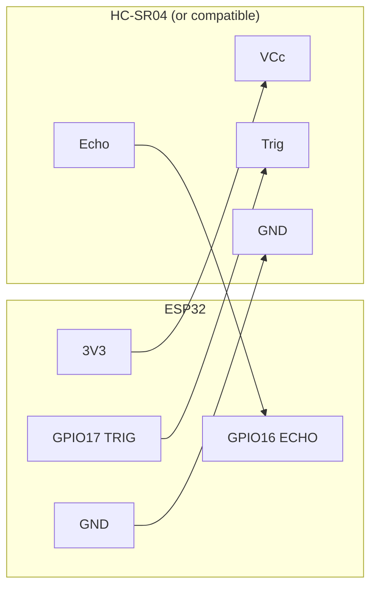
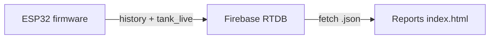

# Water Tank Monitor (ESP32)

This repo has two parts:

1. **Firmware** (`WaterTankSensorSketch.ino`) — ESP32 + ultrasonic sensor. It measures distance, derives tank fill level, and syncs readings to **Firebase Realtime Database** (live snapshot + per-day history). It also exposes a setup portal, NVS-backed settings, optional cloud config, HTTP OTA, and a small local HTTP API.

2. **Reports** (static web app: `index.html`, `app.js`, `styles.css`) — a **browser dashboard** that reads from **Firebase Realtime Database** (REST) and turns `devices/...` data into analytics. **Full reporting documentation** (sync vs refresh, KPI strip, hero charts, top events, cumulative totals, cache, `localStorage` keys): [REPORTS.md](./REPORTS.md).

## Hardware

| Component | Role |
|-----------|------|
| **ESP32** (WiFi stack, `WebServer`, `Preferences`) | Main controller |
| **HC-SR04** (or compatible 5 V trigger / echo ultrasonic module) | Distance → water level |

### Pin assignment (from firmware)

| Signal | ESP32 GPIO | Sensor pin |
|--------|------------|------------|
| Trigger | **17** | Trig |
| Echo | **16** | Echo |
| Power | **3.3 V or 5 V** (see note) | Vcc |
| Ground | **GND** | Gnd |

**Logic levels:** Many HC-SR04 boards run at 5 V and output **5 V on the Echo line**. ESP32 GPIOs are **not 5 V tolerant**. Safe options:

- Use a **3.3 V–compatible** ultrasonic module, or  
- Power the sensor at 5 V but **level-shift Echo from 5 V → 3.3 V** before GPIO 16, or  
- Use a **voltage divider** (e.g. ~10 kΩ / ~20 kΩ) on Echo if you must run the module at 5 V.

Trig (GPIO 17 → module) is often fine at 3.3 V because the module typically registers 3.3 V as HIGH, but check your module’s datasheet.

## Circuit diagram

### Block diagram (connections)



### Wiring sketch (ASCII)

```
                    ESP32                          HC-SR04
                 +-----------+                    +---------+
    3V3 -------->| 3V3       |                    | Vcc     |
                 |           |                    |         |
    GND -------->| GND       |--------------------| Gnd     |
                 |           |                    |         |
    GPIO17 ----->| GPIO 17   |--------------------| Trig    |
                 |           |                    |         |
    GPIO16 <-----| GPIO 16   |<-------------------| Echo *  |
                 +-----------+                    +---------+

    * If the module runs at 5 V, level-shift or divide Echo before GPIO16.
```

## Software

### Arduino / PlatformIO libraries

From the sketch includes, install (Boards Manager: **ESP32**):

- **ArduinoJson** (v6 API: `DynamicJsonDocument`)
- ESP32 core supplies: `WiFi`, `WiFiClientSecure`, `HTTPClient`, `HTTPUpdate`, `WebServer`, `Preferences`

### Configuration

1. Flash `WaterTankSensorSketch.ino` to the ESP32.
2. On first boot (no saved WiFi), the device starts an access point **`WaterTankMonitor`**.
3. Join that AP and open **`http://192.168.4.1/`** (or the IP shown in Serial).
4. Submit **WiFi SSID/password**, optional **tank name**, **tank height (cm)**, **upload interval (minutes)**, **threshold (%)**, **min valid distance (cm)**, and **OTA check interval**. The device saves settings and restarts.

### Firmware constants

- **`FW_VERSION`**: `"1.0.0"` — used in telemetry and OTA version compare.
- **`firebaseBaseUrl`**: default Firebase Realtime Database root URL (change if you use another project).

## Reports (web dashboard)

Short summary: **Tank Reports** loads **`/devices`** from Firebase RTDB over REST, caches the last successful response in the browser, and renders KPIs, insights, a **hero** chart (type selectable), **top consumption / refill** bar charts, **cumulative** consumed-vs-filled lines, and tabs for device metadata, logs, and errors.

See **[REPORTS.md](./REPORTS.md)** for controls (sync vs refresh), analytics definitions, `localStorage` keys, themes, and the expected JSON shape.

### Data flow (firmware → reports)



## Runtime behavior

- **Sensor:** Seven samples with median filtering; readings outside `minValidDistance` … 500 cm are rejected.
- **Level:** `level_percent = (tankHeightCm - distanceCm) / tankHeightCm * 100`, clamped 0–100%.
- **Uploads:** Each cycle updates **history** (PATCH under `history/<date>.json`) and **live** (`tank_live.json` PUT). *(Note: upload gating via `shouldUpload()` is currently bypassed with `if (true)` in the sketch—every valid reading uploads.)*
- **Cloud config:** Every 10 minutes, GET `devices/<deviceId>/config.json` can override tank height, interval, threshold, min distance, tank name, OTA interval.
- **OTA:** Reads `devices/<deviceId>/firmware.json` or root `firmware.json` for `latest_version`, `url`, `enabled`; uses HTTPS with `setInsecure()` (no certificate pin).

## HTTP endpoints (STA mode, port 80)

| Method | Path | Description |
|--------|------|-------------|
| GET | `/` | Plain text: running status |
| GET | `/level` | JSON: device id, firmware, tank name, level %, water height, distance, `updated_at` |
| GET | `/reconfigure` | Clears saved WiFi credentials and restarts (setup portal on next boot) |

## Firebase paths (reference)

| Path | Purpose |
|------|---------|
| `devices/<deviceId>/bootstrap.json` | Provisioned device metadata |
| `devices/<deviceId>/systeminfo.json` | IP, MAC, RSSI, heap, uptime, etc. |
| `devices/<deviceId>/config.json` | Remote configuration (optional) |
| `devices/<deviceId>/tank_live.json` | Latest reading |
| `devices/<deviceId>/history/<dd-mm-yyyy>.json` | Time-keyed history entries |
| `devices/<deviceId>/logs.json` | PATCH log events |
| `devices/<deviceId>/errors.json` | PATCH errors |
| `devices/<deviceId>/firmware.json` or `firmware.json` | OTA manifest |

`deviceId` is derived from the chip MAC, e.g. `device_XXXXXXXXXXXX`.

## Security notes

- Firebase HTTPS uses **`client.setInsecure()`** — convenient for prototyping; production builds should use **certificate pinning** or a token/auth flow appropriate to your backend.
- The config portal transmits WiFi credentials over HTTP in AP mode — use only on a trusted setup network.

## Serial

- **115200 baud** — boot banner, WiFi status, sensor readings, Firebase response codes, OTA logs.

## License / project

Adjust this section for your team’s license and repository layout.
